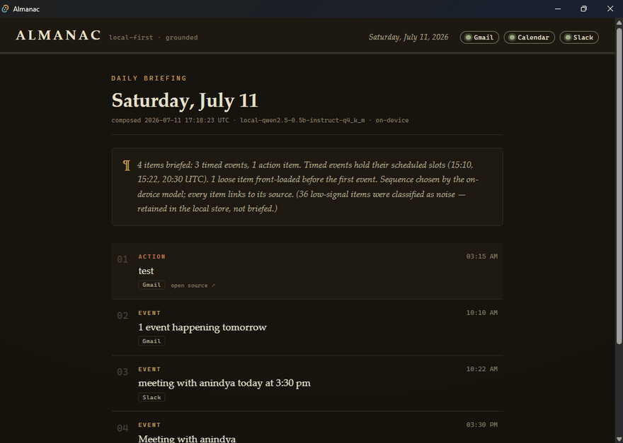

# Almanac

**A local-first daily-briefing desktop agent.** Almanac connects to your Gmail,
Google Calendar, and Slack, classifies the day's items on-device, and opens to
a synthesized "here is your day" briefing — what needs action, what's noise,
in what order, and *why* — with **every item click-through-grounded to the
exact message or event it came from**.



## Why this exists

AI inbox tools are cloud-first (your mail gets uploaded) and produce ungrounded
summaries (no click-back to source; hallucinated tasks). Almanac's bet is the
opposite corner: **local-first + grounded**.

- **Local-first**: raw message and event content is processed entirely
  on-device and is never transmitted. Only you see your data.
- **Grounded**: every briefed item carries a provenance handle to the exact
  source object. Nothing is surfaced that can't be traced back — an ungrounded
  item is a *hard pipeline failure*, not a display glitch.

That privacy sentence is enforced, not aspirational — see below.

## How the privacy claim is enforced

- `RawContent` (and `SourceObject`) **do not implement `serde::Serialize`** —
  a compile-time guarantee, pinned by `static_assertions` in
  [`tests/raw_content_local.rs`](crates/almanac-core/tests/raw_content_local.rs).
  Outbound request *bodies* are built through serde, so raw content cannot be
  placed into one. (One honest scope note: URL query strings are built as
  plain strings, a channel the type system does not police — every adapter
  call site only ever sends window timestamps, API-issued cursors/ids, and
  channel ids, verified by enumeration, but the guarantee is narrower than
  "no outbound call can carry it".) `RawContent`/`SourceObject` also carry a
  manual redacted `Debug`, so a stray `{:?}` can't leak bodies to logs. The UI
  receives a string-field DTO (summary, kind, provenance) over Tauri IPC —
  never raw payloads.
- **Extraction runs on-device**: all-MiniLM-L6-v2 (ONNX, via pure-Rust
  tract-onnx). Verified with the network physically disabled: the pipeline's
  own probe reported `network: UNREACHABLE — offline run confirmed`, then
  classified and persisted every fixture item.
- **Synthesis runs on-device**: Qwen2.5-0.5B-Instruct (Q4_K_M GGUF, via
  pure-Rust candle). Same network-disabled verification: a full
  fixtures → extraction → briefing run completed offline.
- OAuth tokens are stored **DPAPI-encrypted** (Windows, bound to your OS
  user), never plaintext, at gitignored paths. Non-Windows platforms fail
  loudly rather than fall back to plaintext.

What *does* leave the machine: OAuth requests to Google/Slack and the API
calls that fetch your data (read-only scopes). Nothing else.

**At-rest posture (honest):** OAuth *tokens* are DPAPI-encrypted, but the
fetched message/event content is stored **unencrypted** in the local SQLite DB
(`%APPDATA%\Almanac\almanac.db`). The privacy claim is about *transmission*
(nothing is sent off-device), not at-rest encryption — the DB is as protected
as your OS user account. Encrypting `raw_json` (via the existing DPAPI helpers
or SQLCipher) is a known, deliberate follow-up, not a shipped feature.

## The grounding story

Grounding is enforced at four layers — memory, wire, disk, render:

1. **Memory**: `ExtractedItem` has private fields; its only constructor
   rejects empty native ids and non-https deep links. The synthesis model
   never sees or emits IDs — it orders a numbered digest, and planned items
   are built in code from the real items.
2. **Wire**: the model's reply must be an exact permutation of the digest
   indexes (1..=n, each exactly once). Anything else is rejected and retried
   once, then the pipeline fails.
3. **Disk**: SQLite composite foreign keys (`extracted_items` and
   `briefing_items` → `source_objects`) make an unresolvable item
   unpersistable.
4. **Render**: the UI reads briefings via an INNER JOIN on `source_objects` —
   an item that doesn't resolve cannot even be loaded for display.

**This fired for real.** On the first network-disabled end-to-end run, the
local model echoed digest text into its ORDER line instead of bare numbers.
The parser rejected it, the retry also failed, and the pipeline **refused to
produce a briefing** — a hard failure instead of silent garbage. The prompt
and parser were then hardened (the permutation check is unchanged), and the
incident is kept here as evidence the validator is not advisory.

Deep links are real: Gmail (`mail.google.com/mail/#all/<id>`), Calendar (the
event's own `htmlLink`), Slack (workspace archives permalink — verified
**byte-identical** to Slack's canonical `chat.getPermalink` output).

## Architecture

```
+------------------------------------------------------------+
|  Tauri shell (React/Vite)  — briefing ledger, click-through |
|  source status; consumes string DTOs via IPC only           |
+---------------------------|--------------------------------+
                            | Tauri IPC
+---------------------------v--------------------------------+
|  almanac-core (headless Rust; runs & tests without the UI)  |
|                                                             |
|  SourceAdapter trait          Extraction        Synthesis   |
|   - GmailAdapter        -->    rules +     -->  Backend     |
|   - CalendarAdapter            MiniLM           trait       |
|   - SlackAdapter               embeddings       (local Qwen)|
|        |                          |                |        |
|        v                          v                v        |
|  encrypted token store   SQLite: source_objects | extracted |
|  (DPAPI)                 _items | briefings  (FK-grounded)  |
+-------------------------------------------------------------+
```

- **Payload-first**: adapters were modeled against captured real API
  responses (committed, redacted, in `/fixtures`), not docs —
  [`PAYLOAD_CORRECTIONS.md`](PAYLOAD_CORRECTIONS.md) documents 34 places the
  real payloads differ from what the docs imply.
- **Hybrid classifier**: high-precision rules first (calendar events,
  bulk-mail headers, Slack system messages, explicit ask/promise patterns),
  MiniLM prototype-similarity for the undecided rest; low-confidence items are
  flagged noise, retained, and auditable — never dropped.
- **Swappable synthesis**: the `SynthesisBackend` trait keeps the local model
  replaceable; the ordering is the model's, the rationale text is templated
  from real signals of the chosen sequence (see honest misses for why).
- **Run-scoping**: briefings select the latest extraction per source object
  over the user's **local** calendar day (DST-aware). Tomorrow's events surface
  in a separate "Coming up" preview rather than hijacking today's plan.
  Google calendar-notification emails that duplicate a briefed event are
  suppressed from selection — matched either by the event id embedded in the
  email's link (high precision) or, for pure agenda-digest emails, by the
  Google-Calendar sender when calendar items are already present that day.
  Everything stays stored; only the *selection* is dedup'd.

## Honest misses

Things that don't work as well as the demo suggests, measured, not vibes:

- **Classifier accuracy is 81% on the embedding path** (13/16 on a hand-labeled
  set that deliberately avoids every rule; rules handle the easy majority
  first). The three misses, named: a commitment read as an action-needed
  ("As promised, the budget summary … lands with you Monday" — recipient-directed
  phrasing), an informal event lost to low-confidence noise ("Coffee catch-up
  with Priya on Friday morning"), and an action read as noise ("The contract is
  waiting for your signature before it expires"). The structural limit:
  zero-shot text similarity can't reliably tell **who owes whom** — my promise
  vs. your ask needs sender/recipient modeling it doesn't have.
- **A 0.5B model can order better than it can explain.** Its sequences were
  consistently reasonable (events in time order, urgent work early), but its
  prose rationales were repetitive and semi-garbled. So the rationale you see
  is **deterministic and templated from real signals** (counts, event slots,
  what was front-loaded, what was suppressed); the model contributes ordering
  only. That's a capability boundary, documented rather than hidden.
- **Synthesis takes ~20–40 s** of CPU per briefing (0.5B Q4 on candle, greedy).
  Fine for once-a-morning; wrong for interactive use. Debug builds are ~20×
  slower — the workspace compiles dependencies optimized even in dev for this
  reason.
- **Real inboxes are mostly noise** — a live run briefed 4 items and filed 43
  as noise (correctly: newsletters, CI failures, sign-in alerts). Borderline
  content cuts both ways: an email with subject "test" squeaked into the
  briefing as action-needed at 0.34 similarity, while one-word Slack messages
  ("hi") were filed as low-confidence noise.
- **Slack tokens don't refresh** unless the Slack app opts into token
  rotation, which is irreversible — so the refresh path for Slack validates
  the non-expiring token live (`auth.test`) and says so, while the Google path
  does a real `refresh_token` rotation (verified by token fingerprint change).
- **Third-party web apps occasionally mis-handle a correct deep link.** Slack's
  browser interstitial can drop the message anchor (lands on the channel, not
  scrolled to the message) — though the link is byte-identical to Slack's own
  `chat.getPermalink`. Google Calendar sometimes shows "Could not find the
  requested event" on first load of an `eid` link and resolves on refresh —
  and the link is Google's own `htmlLink`, stored verbatim (the decoded `eid`
  matches the stored event id). Both are downstream web-app quirks on links
  Almanac constructs correctly, not grounding failures.
- **Google testing-mode consent expires every 7 days.** Composing degrades
  gracefully — an expired Gmail token still yields a Slack+Calendar briefing
  whose rationale notes "Gmail was unavailable this run"; a compose fails
  entirely only when *every* source fails. The status chip also warns when the
  token is older than 7 days.
- **Fetch is capped and the cap is now reported.** Each source pages up to a
  fixed bound (100 Gmail messages, 200 Calendar events, 400 channels/400
  msgs-per-channel per window). On a busy week the briefing rationale says so
  ("Gmail results were truncated at the fetch cap") rather than silently
  dropping recall.
- **Gmail deep links assume the browser's default Google account.** The
  `#all/<id>` form opens `/u/0`; a multi-account user whose connected account
  isn't the default lands in the wrong mailbox. Assessed during the audit and
  left as-is rather than shipping an `authuser=` form I couldn't verify against
  multiple accounts without risking the verified single-account behavior.
- **Windows-only token encryption** (DPAPI). Other platforms need a keychain
  backend and currently refuse to store tokens rather than write plaintext.
- Fixed after a full principal-engineer audit (all had regression tests added):
  a briefing-day *hijack* (a standing event tomorrow could date the briefing
  tomorrow and drop today), all-day events anchored to UTC instead of local
  midnight, UTC clock times misleading the model's ordering, a DST-at-midnight
  day that hard-failed, `csp: null` and an over-broad URL opener on the
  webview, and a `Debug` impl that could have logged raw content. Earlier
  hardening also fixed UTC day boundaries, the fetch window missing future
  events, and added the conservative cross-source dedup — whose caution proved
  itself when a third-party email titled "1 event happening tomorrow" (which
  *looks* like a Google agenda digest) was correctly left briefed rather than
  wrong-merged.

## Setup (honest version)

Windows-first (token encryption is DPAPI). Prereqs: Rust (MSVC toolchain),
Node 18+.

```powershell
git clone https://github.com/ManeeshJupalle/Almanac.git; cd Almanac
npm install

# one-time model downloads (~580 MB total; inference never touches the network)
mkdir models\minilm, models\qwen2.5-0.5b-instruct
curl.exe -L -o models\minilm\model.onnx https://huggingface.co/sentence-transformers/all-MiniLM-L6-v2/resolve/main/onnx/model.onnx
curl.exe -L -o models\minilm\tokenizer.json https://huggingface.co/sentence-transformers/all-MiniLM-L6-v2/resolve/main/tokenizer.json
curl.exe -L -o models\qwen2.5-0.5b-instruct\model.gguf https://huggingface.co/Qwen/Qwen2.5-0.5B-Instruct-GGUF/resolve/main/qwen2.5-0.5b-instruct-q4_k_m.gguf
curl.exe -L -o models\qwen2.5-0.5b-instruct\tokenizer.json https://huggingface.co/Qwen/Qwen2.5-0.5B-Instruct/resolve/main/tokenizer.json
```

(On macOS/Linux use `mkdir -p models/minilm models/qwen2.5-0.5b-instruct` and
`curl` — but note token encryption is Windows-only for now; see honest misses.)

Credentials (bring your own — nothing is provisioned for you):

1. **Google**: create a Google Cloud project, enable the Gmail and Calendar
   APIs, configure the OAuth consent screen (External + *Testing* is fine —
   add yourself as a test user; note that **testing-mode refresh tokens
   expire after 7 days** and you'll re-consent weekly), create a **Desktop
   app** OAuth client, download it as `credentials.json` into the repo root.
2. **Slack**: create an app at api.slack.com, add
   `http://localhost:8080/callback` as a redirect URL, copy the client
   id/secret.
3. `Copy-Item .env.example .env` (PowerShell; `cp` on macOS/Linux) and fill in
   the Slack values.

First run:

```sh
cargo run -p fixture-capture -- google-auth   # one-time browser consent
cargo run -p fixture-capture -- slack-auth    # one-time browser consent
cargo run -p almanac-core -- --self-check     # prints "core ok"
cargo test -p almanac-core                    # model tests self-skip if models absent
npm run tauri dev                             # open the app → Compose today's briefing
```

The SQLite store lives at `%APPDATA%\Almanac\almanac.db`. Tokens are
DPAPI-encrypted under `tokens/` (gitignored). The first `Compose` fetches a
7-day window (plus tomorrow, for calendar), classifies on-device, sequences
with the local model (~1 min total), and persists the briefing — relaunching
the app renders it from SQLite instantly.

### Packaging status (honest)

`tauri build` produces a working release binary that resolves `.env`, tokens,
and models by searching upward from the executable — running it from a
checkout works. A distributable installer (config/keychain migration away
from repo-relative paths) is future work; v0.1.0 is a run-from-checkout
release by design.

## CLI (headless core)

The engine runs and is tested without the UI:

```sh
cargo run -p almanac-core -- --self-check       # db + migrations sanity
cargo run -p almanac-core -- extract-fixtures   # offline: fixtures → classified items (prints network probe)
cargo run -p almanac-core -- e2e-fixtures       # offline: fixtures → extraction → validated briefing
cargo run -p almanac-core -- live-briefing      # full live chain, prints the briefing
cargo run -p almanac-core -- refresh-google     # forced token refresh with fingerprint evidence
```

## Stack

| Layer | Choice |
|---|---|
| Core engine | Rust, headless crate (`almanac-core`), 54 tests |
| Desktop shell | Tauri v2 (thin IPC client, no engine logic; strict CSP, scoped opener) |
| UI | React + Vite, hand-rolled CSS |
| Store | SQLite (rusqlite, embedded migrations, FK-grounded) |
| Extraction | all-MiniLM-L6-v2 ONNX via tract-onnx (pure Rust) |
| Synthesis | Qwen2.5-0.5B-Instruct GGUF via candle (pure Rust) |
| Tokens | Windows DPAPI, encrypted at rest |
| CI | Linux + Windows (DPAPI) test jobs, workspace build, `cargo`/`npm audit` |

Built in six phases (scaffold → payload-first fixtures → adapters →
extraction → synthesis → UI → ship), then hardened against a full
principal-engineer audit. `PAYLOAD_CORRECTIONS.md` and the honest misses above
are part of the deliverable, not an apology.
